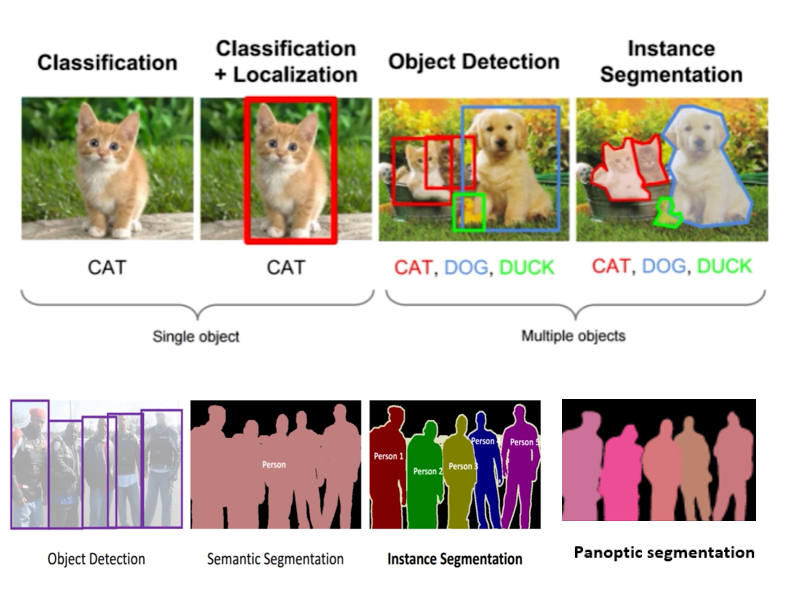
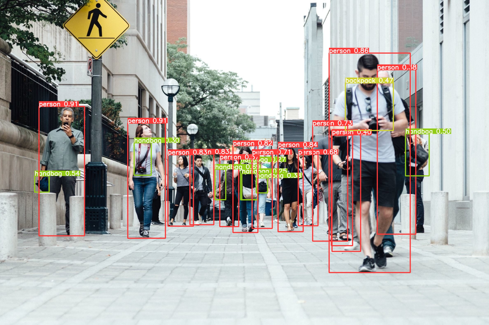
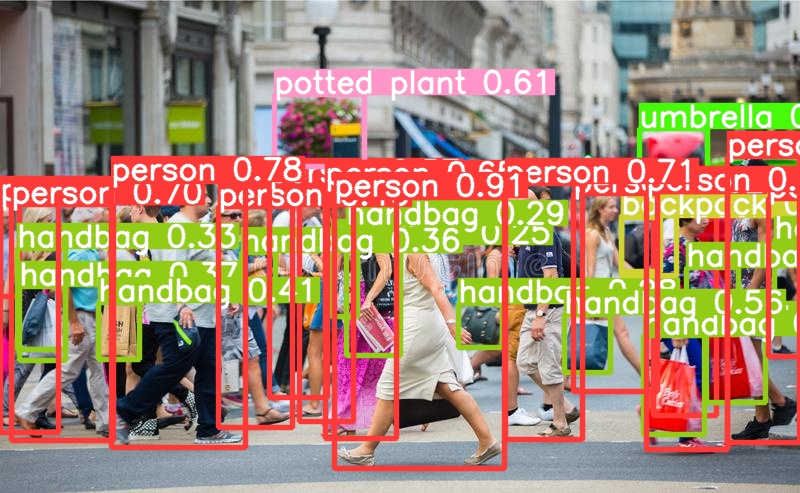
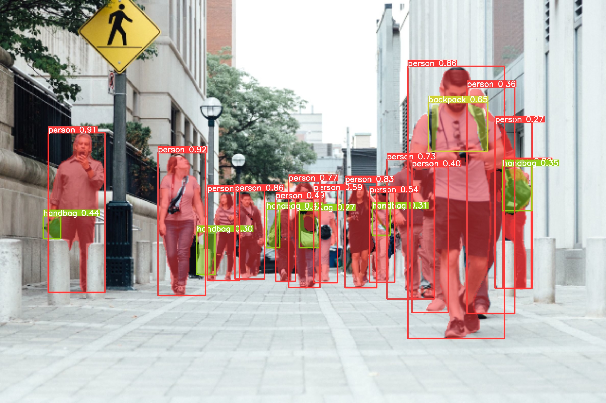
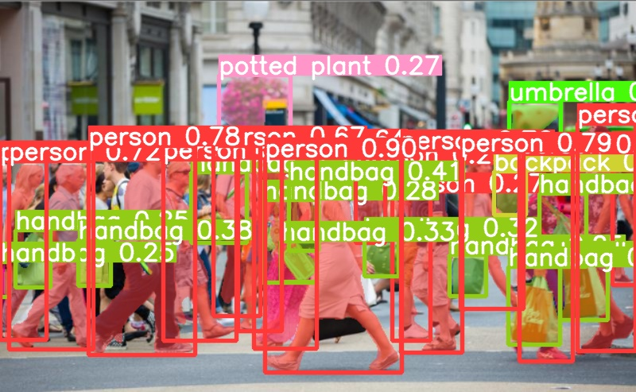

# YOLOv8
YOLOv8 Object Detection &amp; Image Segmentation Implementation (Easy Steps) </p>

 #### Object Detection & Segmentation Concept
<p align="center">
  
</p>

## Functions
- Object Detection 
- Image Segmentation
- [Document](https://docs.ultralytics.com/)

## Download Yolov8 Weights
- Download the pretrained YOLOv8 weights or you can use your own custom trained weights, and paste it in the main folder.

| Object Detection Models                                                              |
| ------------------------------------------------------------------------------------ |

| [YOLOv8n](https://github.com/ultralytics/assets/releases/download/v0.0.0/yolov8n.pt) |
| [YOLOv8s](https://github.com/ultralytics/assets/releases/download/v0.0.0/yolov8s.pt) |
| [YOLOv8m](https://github.com/ultralytics/assets/releases/download/v0.0.0/yolov8m.pt) |
| [YOLOv8l](https://github.com/ultralytics/assets/releases/download/v0.0.0/yolov8l.pt) |
| [YOLOv8x](https://github.com/ultralytics/assets/releases/download/v0.0.0/yolov8x.pt) |

| Image Segmentation Models                                                            |
| ------------------------------------------------------------------------------------ |

| [YOLOv8n-seg](https://github.com/ultralytics/assets/releases/download/v0.0.0/yolov8n-seg.pt) |
| [YOLOv8s-seg](https://github.com/ultralytics/assets/releases/download/v0.0.0/yolov8s-seg.pt) |
| [YOLOv8m-seg](https://github.com/ultralytics/assets/releases/download/v0.0.0/yolov8m-seg.pt) |
| [YOLOv8l-seg](https://github.com/ultralytics/assets/releases/download/v0.0.0/yolov8l-seg.pt) |
| [YOLOv8x-seg](https://github.com/ultralytics/assets/releases/download/v0.0.0/yolov8x-seg.pt) |

## Implementation 
- Create Conda Environment

```
conda create –n yolov8 python=3.9
conda activate yolov8
```
<details open>
<summary>Install</summary>
  
- Pip install the ultralytics package including all requirements.txt 
  
```
pip install ultralytics
```  
  <details open>
<summary>CLI</summary>
    
   - Run yolov8 directly on Command Line Interface (CLI) with commands mentioned below. It has various hyperparameters and configurations.
  
 ```
  yolo task=detect mode=predict model=yolov8n.pt source=img.jpg         #object detection on image
  yolo task=detect mode=predict model=yolov8n.pt source=1.jpg conf=0.5  # Set the confidence level at 0.5
  yolo task=detect mode=predict model=yolov8n.pt source=1.jpg conf=0.5 show=true     # Show output in real-time
  yolo task=detect mode=predict model=yolov8n.pt source=1.jpg conf=0.5 save_txt=true  # Save the bounding boxes information
  yolo task=detect mode=predict model=yolov8n.pt source=1.jpg conf=0.5 save_crop=true  # Save cropped objects
  yolo task=detect mode=predict model=yolov8n.pt source=1.jpg conf=0.5 save_crop=true hide_labels=true hide_conf=true  #Remove the label and confidence level
  yolo task=detect mode=predict model=yolov8s.pt source=0 #Object Detection on webcam
  yolo task=detect mode=predict model=yolov8s.pt source=video.mp4 show=true     # Object Detection on MP4 Video
  yolo task=detect mode=predict model=yolov8s.pt source='C:\Users\zeeshan\Desktop\yolov8'  #Object Detection on directory 
  ```
  
## Main Code Python
- Use any model and source just uncomment it and run file on conda environment.
    
```
from ultralytics import YOLO
#import cv2
#import time
#import os


# Object Detection Models

#model = YOLO("yolov8x.pt")          # Detection ( Extra Large )
#model = YOLO("yolov8l.pt")           # Detection ( Large Model )
#model = YOLO("yolov8m.pt")          # Detection ( Medium Model)
#model = YOLO("yolov8s.pt")          # Detection ( Small Model )
model = YOLO("yolov8n.pt")          # Detection ( Nano Model  ) 


#Segmentation Model

#model = YOLO("yolov8m-seg.pt")       # Segmentation (Medium Model)

# Predictions for  Directory Folder, videos, images, and webcam

model.predict(source="C:/Users/zeeshan/Downloads/yolov8/Data/Images", show=True, save=True) # Images Directory Folder
#model.predict(source="C:/Users/zeeshan/Desktop/yolov8/Data/Videos", show=True, save=True) # Videos Directory Folder
#model.predict(source= '0', show=True, save=True) # Webcam

#model.info(verbose=True)  '                     # Print model information
#model.export(format="onnx")                    #export model into ONXX

```
  # Results
  ### Object Detection
   <p>
 
    

 ### Image Segmentation
   <p>
  
  
     
